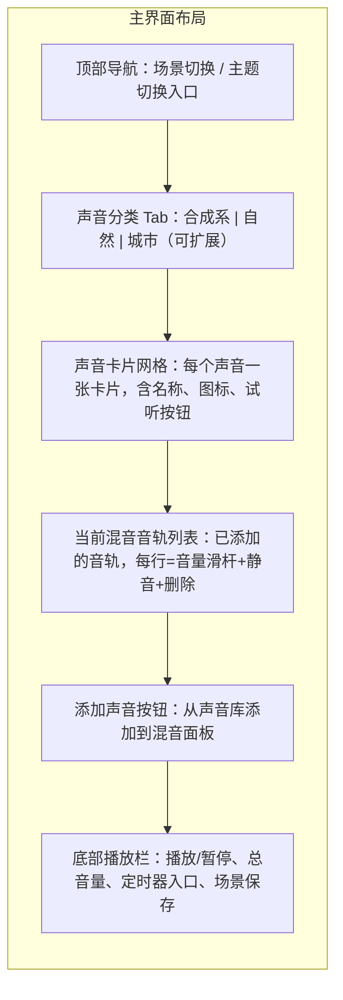
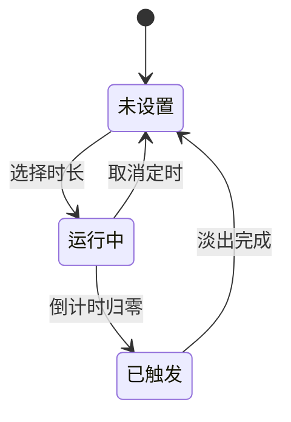
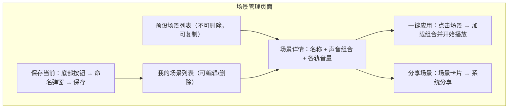

# 白噪音 App 产品需求文档（PRD）

日期：2026-08-17
版本：v2.0
状态：草稿

---

## 1. 需求背景

### 1.1 业务背景

全球助眠类 App 下载量在 2026 年同比增长 38%，自然音场、冥想、轻唤醒与睡眠监测类功能最受欢迎。[数据支撑] 中国在线音频用户规模已达 5.4 亿，声音经济产业规模 5688 亿元，预计 2029 年突破 7400 亿元。[数据支撑]

市场上已有潮汐（3000 万用户）、小睡眠（8000 万用户）、Calm、Headspace 等成熟产品，但多数产品存在两个空白：一是多声音混合调音普遍做得不够自由——要么只支持固定组合，要么独立音量控制弱；二是界面风格千篇一律，用户无法按个人审美切换视觉主题。同时，大部分竞品缺少用户裂变机制，增长依赖广告投放。

### 1.2 用户痛点

- **入睡困难者**：需要背景音助眠，但单一声音容易腻，组合声音又难以找到合适的音量配比。
- **办公/学习人群**：需要持续的降噪白噪音，但大多数 App 操作复杂，切换声音有爆音，打断了专注状态。
- **审美敏感用户**：市面上的白噪音 App 界面同质化严重，要么过于花哨干扰入睡，要么过于简陋没有质感。
- **分享诉求**：用户找到一套喜欢的组合后，想让朋友也试试，但现有产品很少支持一键分享。

### 1.3 不解决的后果

- 用户继续在多个 App 之间切换，难以形成稳定的使用习惯。
- 混音体验差导致用户流失到竞品，或彻底放弃使用白噪音。
- 缺少裂变能力，获客只能依赖高成本广告投放。

### 1.4 产品定位

一款**以多声音混合调音为核心、以多主题视觉切换为差异**的白噪音 App。用 Flutter 一套代码覆盖 iOS + HarmonyOS + Android 三端，优先 iOS 与鸿蒙。

---

## 2. 竞品研究

### 2.1 研究目标

| 竞品 | 产品定位 | 用户规模 | 核心亮点 |
|---|---|---|---|
| 潮汐 | 睡眠+冥想+专注一体化 | 全球 3000 万 | 极简克制设计，专业冥想内容，教育优惠 148 元/年 |
| 小睡眠 | 全功能睡眠平台 | 8000 万 | 声音素材最丰富，AI 深睡，睡眠监测，ASMR |
| Calm | 英文睡前故事+冥想 | 全球超 1 亿 | 明星讲述睡眠故事，品牌知名度最高，年费 $69.99 |
| BetterSleep | 声音自定义 | 中等规模 | 多声音图层叠加，自定义混音 |
| Headspace | 结构化正念训练 | 全球超 7000 万 | 动画化引导，逐级课程体系 |

### 2.2 功能对比矩阵

| 维度 | 潮汐 | 小睡眠 | Calm | BetterSleep | 本产品 |
|---|---|---|---|---|---|
| 多声音混合 | 有限 | 支持 | 有限 | 支持 | **核心能力** |
| 独立音量调节 | 无 | 有 | 无 | 有 | **核心能力** |
| 多主题切换 | 无 | 无 | 无 | 无 | **独家差异** |
| 定时器 | 有 | 有 | 有 | 有 | 有 |
| 后台播放 | 有 | 有 | 有 | 有 | 有 |
| 睡眠监测 | 有 | **强** | 无 | 有 | 无（定位不同） |
| 冥想引导 | **强** | 有 | **强** | 有 | 无（定位不同） |
| 场景分享 | 无 | 无 | 无 | 无 | **有** |
| 用户裂变 | 无 | 无 | 无 | 无 | **有** |
| 跨平台 | iOS/Android | iOS/Android | iOS/Android | iOS/Android | **iOS/HarmonyOS/Android** |

### 2.3 竞品结论

**机会缺口：** 目前没有一款白噪音 App 同时做到"自由混音 + 多主题切换 + 场景分享裂变"。潮汐和小睡眠功能丰富但越来越重，Calm / Headspace 是高门槛订阅制，BetterSleep 混音体验好但视觉单一。

**差异化定位：** 主打"混音自由 + 审美自由 + 分享裂变"三合一。不卷内容数量（冥想、故事、监测），聚焦做最好的混音体验和最美的界面。

---

## 3. 用户与场景

### 3.1 目标用户画像

| 画像 | 场景 | 频率 | 痛点等级 | 决策权 |
|---|---|---|---|---|
| 失眠人群（25-40 岁都市白领） | 睡前 30 分钟开启助眠音，设备放床头 | 每日 | 高 | 自用 |
| 办公/学习专注者（20-35 岁） | 工作时开启降噪白噪，配合耳机 | 工作日 | 中 | 自用 |
| 冥想/放松爱好者 | 冥想、瑜伽、阅读时做背景音 | 每周 3-5 次 | 中 | 自用 |
| 审美驱动型用户 | 对 App 界面有要求，喜欢个性化 | 每日 | 中 | 自用+推荐 |
| 分享型用户 | 喜欢把自己搭配的声音组合分享给朋友 | 偶尔 | 低 | 推荐+裂变源 |

### 3.2 核心场景优先级

1. **睡前助眠**（最高频、刚需）：打开 App → 选择或应用预设场景 → 设定 30 分钟定时 → 锁屏入睡。
2. **专注工作**（高频）：打开 App → 选择白噪音 → 调整音量 → 持续播放。
3. **分享推荐**（裂变）：用户搭配好一组声音 → 生成分享卡片 → 发给朋友 → 朋友一键导入。
4. **个性化装扮**（留存）：浏览主题 → 切换风格/配色 → 即时生效。

---

## 4. 功能需求

### 4.1 功能总览表

| # | 模块 | 功能描述 | 优先级 |
|---|---|---|---|
| 1 | 声音库 | 内置白/粉/褐/棕噪音，按类别分组浏览，支持搜索与试听，预留真实录音接入点 | P0 |
| 2 | 混音面板 | 多路声音同时加载，每路独立音量滑杆（0-100），支持静音，拖拽排序，实时预览混音效果 | P0 |
| 3 | 播放控制 | 播放/暂停/停止，总音量，淡入淡出，播放状态指示，锁屏/通知栏控制 | P0 |
| 4 | 定时器 | 倒计时选择（5/10/15/30/45/60/90 分钟 + 自定义），倒计时结束自动淡出停止，剩余时间显示与取消 | P0 |
| 5 | 后台播放 | 锁屏/切后台持续播放，各平台音频会话配置，系统音频焦点管理 | P0 |
| 6 | 收藏与历史 | 本地持久化当前组合/音量/主题/定时，启动自动恢复；最近使用列表；收藏管理 | P0 |
| 7 | 主题系统 | 新拟态/玻璃拟态/扁平化三种风格，多套配色（含莫兰迪），即时切换，持久化 | P1 |
| 8 | 场景管理 | 创建/命名/编辑/删除自定义场景，内置预设场景，场景快速切换 | P1 |
| 9 | 应用设置 | 启动行为、淡入淡出时长、混音轨数上限、降级开关 | P1 |
| 10 | 场景分享 | 将自定义场景生成为分享卡片（含场景名、声音组合、封面图），通过系统分享发送；接收方扫码或链接一键导入 | P1 |
| 11 | 用户裂变 | 邀请码机制：每邀请 1 位新用户注册，双方各解锁一个权益（如主题配色、场景上限）；裂变进度看板；分享奖励追踪 | P1 |
| 12 | 助眠提醒 | 每日定时本地通知，点击进入指定场景并播放 | P2 |
| 13 | 使用统计 | 本地播放时长、场景使用频率、连续使用天数，可视化看板 | P2 |
| 14 | 成就系统 | 连续使用里程碑、场景创建数、分享次数等成就徽章，首页展示最近 3 个，独立页面展示全部 | P2 |

### 4.2 模块详细设计

#### 4.2.1 主页 - 声音库与混音面板

用户进入 App 后的主界面，承载声音选择、混音、播放控制三大核心操作。



**交互逻辑：**

- 用户点击声音卡片 → 该声音加入混音面板（音轨列表底部新增一行），自动开始播放。
- 音轨列表每行包含：声音名称、音量滑杆（0-100，默认 50）、静音开关、删除按钮。
- 音量滑杆拖拽时实时生效，拖动结束记录最终值用于持久化。
- 拖拽音轨可调整排序（不影响混音输出，仅 UI 展示顺序）。
- 音轨数达到上限时，添加按钮置灰，提示"已达混音上限（N 路）"。
- 底部播放栏始终可见，包含播放/暂停按钮、总音量滑杆、当前定时剩余（如有）、场景保存按钮。

**规则约束：**

- 混音上限：默认 6 路，可在设置中调整为 4/6/8。
- 音轨名称：显示对应声音名称，最长 20 字符，超出省略。
- 总音量：0-100，与各轨音量独立，总音量控制的是混音后输出的增益。

**边界与异常：**

- 所有音轨被删除 → 混音面板为空 → 播放按钮置灰，提示"添加声音开始混音"。
- 音轨数为 0 时无法播放，点击播放按钮无响应。
- 网络/设备状态不影响声音播放（所有声音为本地生成或离线缓存）。

#### 4.2.2 播放控制与状态机

```
播放器状态：IDLE → PLAYING ⇄ PAUSED → STOPPED → IDLE
```

| 当前状态 | 允许操作 | 目标状态 | 说明 |
|---|---|---|---|
| IDLE | 添加声音并播放 | PLAYING | 音轨数 > 0 时自动进入 |
| PLAYING | 暂停 | PAUSED | 淡出后暂停 |
| PLAYING | 停止 | STOPPED | 淡出后停止，清空定时器 |
| PLAYING | 定时到期 | STOPPED | 淡出后停止 |
| PAUSED | 恢复播放 | PLAYING | 淡入后继续 |
| PAUSED | 停止 | STOPPED | 直接停止 |
| STOPPED | 播放 | PLAYING | 重新开始 |
| 任意 | App 进入后台 | 不变 | 后台继续播放 |
| 任意 | 音频焦点丢失（如来电） | PAUSED | 自动暂停 |

**交互逻辑：**

- 播放 → 淡入（0.5-2s，默认 1s），淡入期间播放按钮显示加载态。
- 暂停/停止 → 淡出（0.5-2s，默认 1s），淡出完成后状态变更。
- 定时到期 → 在到期前 5s 开始淡出，淡出完成后停止。
- 锁屏/通知栏控制：播放/暂停按钮，与 App 内状态实时同步。

#### 4.2.3 定时器



**交互逻辑：**

- 用户点击定时器入口 → 弹出时长选择面板，含预设选项（5/10/15/30/45/60/90 分钟）和自定义输入。
- 选择后定时器开始倒计时，底部播放栏显示剩余时间（如"剩余 28:30"）。
- 倒计时归零前 5 秒开始淡出，淡出完成停止播放。
- 用户可随时取消定时，定时取消后播放继续。

**规则约束：**

- 自定义时长：1-240 分钟，步长 1 分钟。
- 定时器与播放状态关联：播放停止时定时器自动取消。

#### 4.2.4 场景管理



**交互逻辑：**

- 预设场景：内置 3-5 套（如"深度睡眠""专注白噪""自然放松"），不可删除，用户可复制为自定义场景后修改。
- 我的场景：用户创建的全部场景，支持长按编辑名称、滑动删除。
- 保存当前场景：从底部按钮触发，弹出命名弹窗，默认名称为"场景 YYYY-MM-DD HH:mm"，用户可修改。
- 场景数量上限：预设 5 套 + 自定义 20 套（上限可在设置中调整）。

**规则约束：**

- 场景名称：文本，2-20 字符，必填，不可纯空格。
- 场景数据：存储声音 ID 列表 + 各轨音量值 + 总音量 + 主题/配色偏好。

#### 4.2.5 场景分享（增长裂变核心）

**交互逻辑：**

- 用户在场景详情页点击"分享" → 系统生成分享卡片（含场景名称、声音组合展示、封面图、二维码）。
- 分享卡片通过系统分享面板发送（微信/QQ/微博/复制链接等）。
- 接收方点击链接或扫码 → 打开 App 或引导下载 → 新用户注册后自动导入该场景 → 计入邀请者的裂变进度。
- 分享卡片包含邀请者标识，用于追踪裂变来源。

**边界与异常：**

- 接收方已安装 App → deeplink 直接打开并导入场景。
- 接收方未安装 → 引导至应用商店下载页，下载安装后首次启动自动导入场景并关联邀请关系。
- 同一场景被同一用户重复导入 → 提示"已导入过此场景"。

#### 4.2.6 用户裂变系统

**概述：** 通过邀请码和场景分享双路径驱动用户增长，邀请双方均获得权益激励。

**邀请码机制：**

- 每个用户生成唯一邀请码（6 位字母数字组合）。
- 新用户注册时可选填邀请码。填写后，邀请者和被邀请者各获得一项权益。
- 权益池：解锁 1 套专属配色 / 场景上限 +5 / 解锁 1 套专属主题风格。

**裂变进度看板：**

- 展示已邀请人数、已解锁权益、下一档奖励。
- 阶梯奖励：邀请 1 人 → 解锁 1 项，邀请 3 人 → 解锁 2 项，邀请 10 人 → 解锁全部权益。
- 邀请历史：展示被邀请者昵称、注册时间、是否已导入场景。

**规则约束：**

- 同一设备不重复计入（防止刷量）。
- 邀请码有效期：永久。
- 权益与账号绑定，本地持久化。

#### 4.2.7 主题系统

**交互逻辑：**

- 主题切换入口：主页顶部导航或设置 → 主题选择页。
- 风格选择：新拟态 / 玻璃拟态 / 扁平化，切换即时预览。
- 配色选择：每个风格下 3-6 套配色（至少含一套莫兰迪配色），切换即时预览。
- 确认后持久化，退出设置即生效。

**规则约束：**

- 风格与配色独立选择，组合数 = 风格数 × 配色数。
- 默认风格：扁平化 + 默认配色（保证最广泛的兼容性）。
- 降级处理：主题资源加载失败时回退默认风格，不影响功能。

#### 4.2.8 成就系统

**成就定义：**

| 成就 ID | 名称 | 触发条件 | 展示 |
|---|---|---|---|
| ACH_001 | 初次入眠 | 首次使用定时器完成一次播放 | 徽章 |
| ACH_002 | 连续七天 | 连续 7 天使用 App | 徽章 |
| ACH_003 | 声音调音师 | 创建 5 个自定义场景 | 徽章 |
| ACH_004 | 分享达人 | 成功邀请 3 位好友 | 徽章 |
| ACH_005 | 百日坚持 | 累计使用 100 天 | 徽章 |
| ACH_006 | 午夜电台 | 在 22:00-02:00 期间使用 | 徽章 |
| ACH_007 | 混音大师 | 同时加载 6 路音轨 | 徽章 |
| ACH_008 | 审美家 | 切换过所有主题风格 | 徽章 |

**展示规则：** 首页展示最近获得的 3 个成就，点击进入成就墙页面查看全部。

---

## 5. 数据与指标

### 5.1 核心指标（北极星）

**次日留存率** 与 **7 日留存率**。白噪音 App 的价值在于用户是否愿意持续回来使用。

### 5.2 过程指标

- 新增用户次日/7 日/30 日留存率
- 日均播放时长（分钟）
- 人均每日播放次数
- 场景创建率（创建场景用户数 / DAU）
- 场景分享率（分享用户数 / 场景创建用户数）
- 邀请转化率（注册时填写邀请码的用户数 / 新注册用户数）
- 裂变系数（K 因子 = 邀请人数 × 邀请转化率）

### 5.3 质量指标

- 播放成功率（无异常中断的播放占比）
- 平均启动到可播放时间（秒）
- 崩溃率
- 后台播放中断率（因音频焦点丢失或被系统杀死的占比）

### 5.4 埋点需求

| 事件名 | 触发时机 | 属性 | 决策用途 |
|---|---|---|---|
| `app_launch` | App 启动 | 来源（冷启/热启）、是否自动恢复播放 | 评估启动行为 |
| `sound_add` | 添加声音到混音 | 声音 ID、声音类型、当前音轨数 | 了解声音偏好 |
| `play_start` | 开始播放 | 音轨数、各音轨 ID、是否有定时 | 核心使用漏斗 |
| `play_stop` | 停止播放 | 停止原因（手动/定时到期/其他）、播放时长 | 评估完成度 |
| `timer_set` | 设定定时器 | 时长、来源（预设/自定义） | 优化定时选项 |
| `scene_create` | 创建场景 | 场景名称、音轨数 | 场景功能使用率 |
| `scene_apply` | 应用场景 | 场景 ID、是否预设 | 场景复用率 |
| `scene_share` | 分享场景 | 场景 ID、分享渠道 | 裂变漏斗 |
| `theme_switch` | 切换主题 | 旧风格、新风格、新配色 | 主题偏好分布 |
| `invite_success` | 邀请成功 | 邀请码、被邀请者设备 ID | 裂变转化漏斗 |
| `achievement_unlock` | 解锁成就 | 成就 ID | 成就达成率 |

---

## 6. 依赖、风险与时间线

### 6.1 技术依赖

- 音频引擎：`just_audio`（含 OHOS 支持）+ 自定义 Dart 混音器
- 本地持久化：`shared_preferences` / `hive`
- 系统分享：各平台 share sheet API
- Deeplink：universal link（iOS）/ app link（Android）/ 鸿蒙 scheme
- 本地通知：`flutter_local_notifications`

### 6.2 风险清单

| 风险 | 概率 | 影响 | 缓解方案 |
|---|---|---|---|
| 鸿蒙平台 `just_audio` 兼容性不足 | 中 | 高 | 准备降级方案：鸿蒙用原生音频 API + 平台通道桥接 |
| 后台播放被系统杀死 | 中 | 中 | 前台服务（Android）/ 正确的音频会话配置（iOS/OHOS） |
| 分享链接在微信内被屏蔽 | 高 | 低 | 提供多种分享方式（复制链接、二维码），不依赖单一渠道 |
| 混音引擎性能不足 | 低 | 高 | 可配置音轨上限，低端设备自动降低上限 |
| 裂变刷量 | 中 | 中 | 设备 ID 去重、邀请码关联设备指纹 |

### 6.3 里程碑

| 阶段 | 时间 | 范围 | 交付物 |
|---|---|---|---|
| 技术预研 | 第 1-2 周 | 混音引擎原型、三端音频会话验证 | 可运行的 Demo |
| MVP 开发 | 第 3-8 周 | F1–F6（声音库、混音、播放、定时、后台、收藏） | 可上架测试版本 |
| v1.0 上线 | 第 9-10 周 | MVP + 测试修复 | App Store / 华为应用市场上架 |
| v1.1 迭代 | 第 11-14 周 | F7–F11（主题、场景管理、设置、锁屏控制、场景分享、裂变） | v1.1 正式版 |
| v2.0 迭代 | 第 15-20 周 | F12–F14（助眠提醒、统计、成就系统）+ 云同步（可选） | v2.0 正式版 |

---

## 7. 待决事项

1. 真实录音音源的授权与版权来源（内部录制 vs 采购），决定声音库扩展节奏。
2. 商业模式：免费增值（场景/主题解锁）还是订阅制，影响裂变权益设计。建议：基础功能免费，高级主题/更多场景/更多音轨通过裂变邀请解锁或付费。
3. 云端同步：是否需要账号体系，优先度与商业模式挂钩。建议 MVP 阶段纯本地，v1.1 前评估账号体系的 ROI。